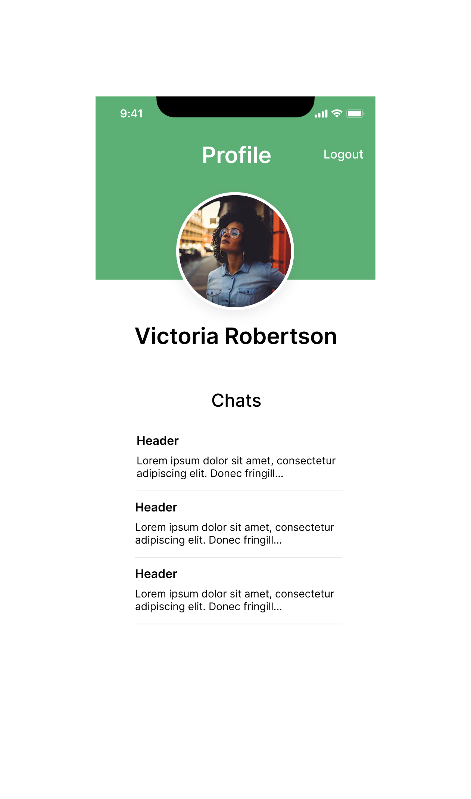

# mind-melter

Welcome to "MindMelter", a learning app that introduces a unique trivia associated with each day's history. Powered by the innovative AI technology of ChatGPT, users can dive deeper into any topic, engage in informative conversations and broaden their knowledge. It's your daily dose of learning, presented in an interactive and enjoyable format.

Step into the world of "MindMelter" and explore the fascinating annals of history at your own pace!

## Wireframes of MindMelter

### Log In

### Sign Up

### Login

### Chat

### Profile

## Project Management

[Location of Project Management Board](https://github.com/orgs/mind-melters/projects/1/views/1)

## Domain Model

## Database Schema

## Team Members

- Alex Carr
- Cameron Griffin
- Matt Austin
- Stephen Levesque
